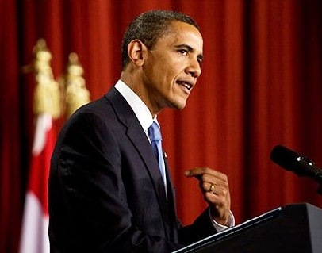

---

Dear Mr. Axelrod, 

I watched President Obama's speech from East Jerusalem, where I was staying during a long tour of Israel and the West Bank. The president's speech made me proud and I was also moved by expressions of hope from Palestinians I talked to afterwards, although they have been betrayed so many times by U.S. policies that this hope can only be described as a guarded hope.

During my stay I visited the Dheisheh refugee camp, just down the road from Bethlehem, and wept at the desperate life for children who followed us around. I was surprised to see how friendly and open inhabitants were to an American, despite the fact that the IDF rousts them every other night and our nation's relationship with Israel is well-known. I visited Hebron, a microcosm of Israel's occupation of the West Bank, where I met both gun-toting settlers and a worker for the Israeli human rights organization B'Tselem. Again, I was shocked at the war zone "reality on the ground" for Arab residents of the H2 zone in Hebron.

I talked to Israelis in Sderot and Ashkelon who have been the target of thousands of Qassam rockets. I talked to Hebrew University students in Jerusalem,&#160; visited Bir Zeit university in Ramallah, and listened to two men from an organization called "Combatants for Peace" who had each lost daughters to violence from the other side.

People on both sides of this conflict are tired and living in fear and under intolerable conditions, particularly Palestinians living under perpetual martial law. The situation simply cannot go on forever. We talked to an Israeli professor who described Israel's settlement efforts as "cantonizing" Palestinians into islands which will ultimately be linked together by bridges and tunnels (already being constructed) to try to satisfy a legalistic requirement of "contiguity." To Palestinians, each of whom knows the details of Oslo, Camp David, and the roadmap to a degree that would shame most journalists, what Israel is doing is tantamount to creating large Indian reservations. And I agree. I can tell you, based on all the conversations I had, any "cantonization" plan would be rejected by even the most moderate of Palestinians. And there are 7 million Palestinian refugees outside Palestine. Any new Palestinian state must be big enough to accommodate some fraction of them who decide to return to a new state.

[")](satellite1.jpg)

I urge President Obama to pressure Israel to accept the Green Line, to remove the "Berlin-like" walls, and to recognize a divided Jerusalem. If Israel cannot do this, the president should hit Israel with sanctions, as the first President Bush threatened to do. The issue of huge illegal settlements like Ma'ale Adumim which cut into the heart of the West Bank, must be negotiated. It might actually serve interests of peace for a few Jewish towns to exist in a new Palestine, just as Muslim towns like Nazareth exist in Israel. But ultimately these are decisions that the PA and Israel will have to make. President Obama's job is to be an honest, unbiased, peace broker. 

I hope the president's speech really is a fresh start with the Muslim world, but Muslims, as he must certainly know, are sensitive to betrayal or words that are not accompanied by action. I hope the president's inspiring words translate into concrete action during the next two years. Otherwise, hope can fade into frustration, and frustration can boil over into violence. I urge the president to demonstrate he meant every word in his Cairo speech, and to deploy Mrs. Clinton and Mr. Mitchell in finally ending this nightmare.

Regards,

David Ehrens