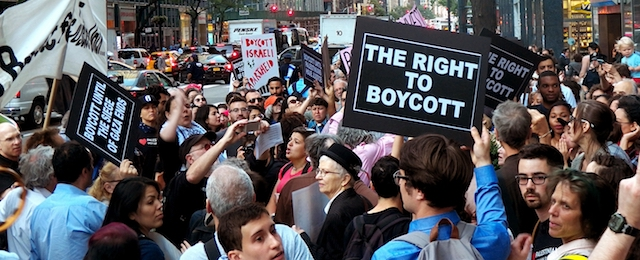

---

Despite plenty of evidence Donald Trump has a thing for Russian mobsters and Kremlin operatives, we still don't know if he actually conspired with Russia to throw the 2016 presidential election.

But [last week I wrote about](/Zionism/must-die/) some **indisputable foreign meddling** -- AIPAC's attempts to take away political rights of Americans to protest Israel's domestic policies with economic boycotts.

And Israel is trying the same thing right here in Massachusetts.

[Massachusetts House bill H.1685](https://malegislature.gov/Bills/190/H1685) and [Senate bill S.1689](https://malegislature.gov/Bills/190/S1689) *sound* harmless enough ("An Act prohibiting discrimination in State Contracts"). No one would ever admit *liking* discrimination. And one would hope that any legislator co-sponsoring bills like these would have only the best of intentions.

But these two bills do much more harm than good.

Like cookie-cutter legislation crafted by ALEC, these were pushed by a pro-Israel organization, the [JCRC](https://www.jcrcboston.org/bds-we-stand-together-against-discrimination/), which regards them as tools to block the [BDS Movement](https://bdsmovement.net/). Lobbyists for Israel have [introduced similar legislation](http://www.righttoboycott.org/) in 35 states and they have been enacted in 19.

Seekonk Rep. Steven Howitt was crystal clear about the bill's intent: “This bill clarifies to businesses that either support BDS or who boycott Israeli-owned businesses and products that the Commonwealth of Massachusetts will not engage in commerce with them.”

In short, this is an **attack on the exercise of the Constitutionally-protected right to boycott** a foreign nation on political grounds. Not surprisingly, [the Massachusetts ACLU opposes H.1685](https://aclum.org/wp-content/uploads/2017/02/aclum-statement-on-state-contracts-bill-01-31-2017.pdf).

The bills' supporters claim that any criticism of Israel's occupation and settlements is tantamount to anti-semitism. But the international [BDS Movement](https://bdsmovement.net/what-is-bds) has specific political goals. And Israel's domestic policies as well as American foreign policy toward it are political issues. Both bills are opposed by a number of Jewish organizations, including the [Boston Workmen's Circle](http://www.circleboston.org/takeaction), [Jewish Voice for Peace](http://jvp-boston.org/10-reasons-anti-bds/), over [100 progressive organizations](http://jvp-boston.org/mafreedomtoboycott/), and also the National Council of Churches. 

In 1982 the [Supreme Court affirmed](https://www.law.cornell.edu/supremecourt/text/458/886) the right of Americans to use boycotts for political purposes. After fifty years of occupation and creeping settlements Israel just might need a little economic incentive to stop. But no matter how you feel about Middle Eastern politics, Israel's problems can not be solved by violating the civil liberties of Americans.

Contact [House](https://malegislature.gov/Bills/190/H1685/Cosponsor) and [Senate](https://malegislature.gov/Bills/190/S1689/Cosponsor) sponsors from your district and ask them to **kill these bills** and withdraw their co-sponsorship.

