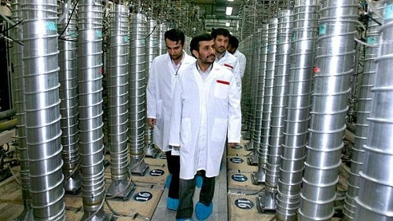
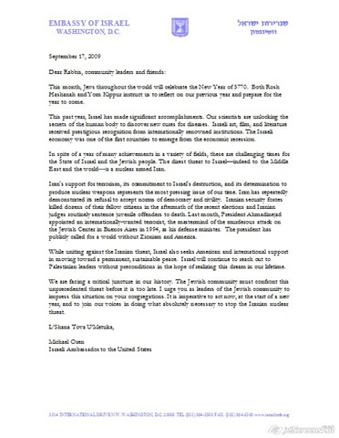

---

How does this sound? **The Iran War**.

Zionist organizations in America are on the warpath. A war with Iran over nuclear exclusivity. The American Jewish Committee released a [video on Youtube](http://www.youtube.com/watch?v=v9CmdaAdqyE) today entitled "This is the button," inexplicably accompanied by lounge music, showing a toy truck followed by a terrorist explosion in Argentina attributed to Iran. Then the image of a child's toy truck is followed by video footage of Iranian thugs on motorbikes terrorizing demonstrators in Teheran. Then videos of hangings of adulterers, and finally the words "This is the button" followed by another image "You don't want to see what Iran does with the button."

Clearly any nation that would murder civilians, suppress dissent, or make a mockery of its legal system cannot be trusted to have nuclear weapons. I certainly agree, but unfortunately these characteristics describe every nation that already possesses nukes, especially Israel.

The AJC goes on to inform us in its online petition to Congress:
  > "With enough low-enriched uranium to build a nuclear weapon, and more centrifuges spinning each day, Iran is dangerously close to crossing the nuclear threshold. A nuclear Iran would particularly threaten Israel and our moderate Arab allies, and would destabilize the Middle East and threaten the security of the entire globe."  

"The security of the _entire globe_." Why is _hasbara_ so melodramatic? A nuclear Iran would indeed spell the last days of Israel's nuclear hegemony but, [according to Ehud Barak](http://www.haaretz.com/hasen/spages/1115282.html) last week, "Israel is strong, I don't see anyone who could pose an existential threat." The **Iran War** will be all about Israel's ability to remain the only nuclear power in the immediate region.

The nation's synagogues have also apparently been enlisted in the **Iran War** by former American Michael Oren, now the Israeli Ambassador to the United States. Oren sent a letter to most American congregations, including mine, to be read during services at Rosh Hashanah. The instructions read:
  > "We are facing a critical juncture in our history. The Jewish community must confront this unprecedented threat before it is too late. **I urge you as leaders of the Jewish community to impress this situation on your congregations. **It is imperative to act now, at the start of a new year, and to join our voices in **doing what [is] absolutely necessary to stop the Iranian nuclear threat**."  

Meanwhile, hardly a peep from the mainstream media on Israel's nuclear weapons program, which now has an estimated 150 to 400 nuclear weapons. The AJC letter sounds like we'd all be doing the Saudis and Egyptians a favor by defending Israeli nuclear hegemony. But those familiar with Israel's history of violence are buying none of it. Egypt, for one, has [categorically rejected](http://ipsnews.net/news.asp?idnews=48156) this notion:
  > "The Middle East does not need any nuclear powers, be they Iran or Israel - what we need is peace, security, stability and development."  

The [Saudis are equally unenthusiastic](http://www.iiss.org/whats-new/iiss-in-the-press/press-coverage-2006/december-2006/israeli-nukes-provoking-arms-race/) about Israeli nuclear capabilities and regard them as the most pressing security threat in the region:
  > "The existing Israeli nuclear capability is the most dangerous strategic threat to Gulf security in the short and medium term," Saudi Prince Muqrin told the International Institute of Strategic Studies.  

What Israel is doing now in Congress and within the Jewish community is reckless: drumming up support for bombing Iran and laying the groundwork for American military and economic support for this needless piece of aggression. One thing the United States does not need right now, and cannot afford, is a _third_ war in the Middle East. If Israel wants to initiate the **Iran War**, it should be prepared to accept all costs and all consequences itself.

If nuclear non-proliferation is truly an American goal, then a nuclear-free Middle East should be the objective. And that includes Israel. Selectively choosing countries for the nuclear club, particularly those with a history of violence in the region, is a bad idea. And going to war to defend a foreign nation's exclusive nuclear capabilities is not only a bad idea, it's a dangerous game that risks pulling us into a third war.

The Iran War.
