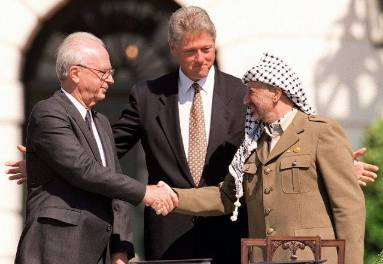
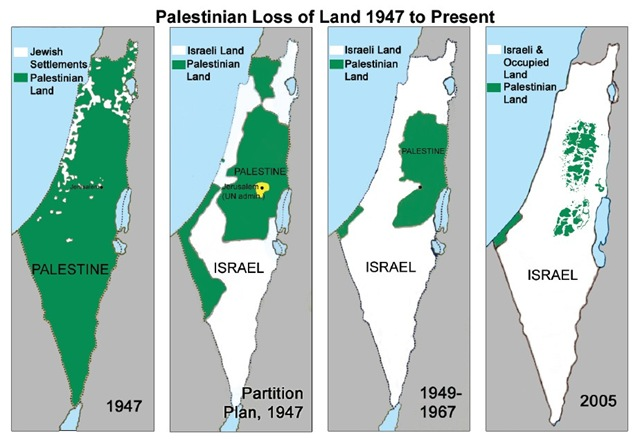

---

The current Middle East peace talks have played out much as they have in past years. The United States lavishes billions of dollars of military aid each year on Israel, ignores or defends its misuse of military power on civilians throughout the world, and still pretends to be an impartial peace broker. The Israeli Right calls for more settlements. The Palestinians, their unity fractured, call for an end to settlement activity. A few days ago a formal 10-month "freeze" on Israeli settlements ended &#8212; although in practice [building never stopped in the West Bank or East Jerusalem](http://maxblumenthal.com/2010/07/the-settlement-freeze-that-never-was-and-never-will-be/). The Palestinian side had warned that they would walk away from the peace talks if building resumed formally, but so far they have only appealed to the United States to exert whatever influence it can to stop the new construction.

The United States and its [Israel Lobby advisors](http://www.reuters.com/article/idUSN11554609) are now asking Israel for a two month extension of the November 2009 ten-month "freeze" [in exchange for backing Israel's annexation of the Jordan valley](http://www.washingtoninstitute.org/templateC05.php?CID=3256) (goodbye 1967 borders!), offering future vetoes in the UN security council in behalf of Israel, additional aid beyond the [$30 billion defense plan](http://www.nytimes.com/2007/08/17/world/middleeast/17israel.html), this year's [$205 million Iron Dome](http://www.haaretz.com/print-edition/news/obama-okays-205m-for-iron-dome-1.290284) gift (which has ballooned to [$422 million](http://www.upi.com/Business_News/Security-Industry/2010/09/28/Israel-gets-boost-in-US-military-aid/UPI-98411285697147/)), a [$3 billion missile shield](http://www.upi.com/Business_News/Security-Industry/2010/09/28/Israel-gets-boost-in-US-military-aid/UPI-98411285697147/) program called David's Sling, and this year's outright gift of [$2.75 billion](http://www.upi.com/Business_News/Security-Industry/2010/09/28/Israel-gets-boost-in-US-military-aid/UPI-98411285697147/) for F35 jets, another $1.5 billion in contracts for parts for those jets, and $2 billion in jet fuel. All this for two months of extending a freeze that actually never happened. Or could these bogus peace talks simply be an opportunity for the US to arm Israel to attack Iran? Obama's willingness to abandon even approximate 1967 borders is something that neither Palestinians, members of the [Arab League](http://www.jpost.com/MiddleEast/Article.aspx?id=189185), Jordan, Syria, or Egypt are likely to accept.

To make matters worse, in this round of talks, Israel has introduced new preconditions which can only be interpreted as signs that, as a recent [TIME magazine article](http://www.time.com/time/covers/0,16641,20100913,00.html) reported, Israelis are not particularly interested in peace. Netanyahu now wants the Palestinians to recognize Israel as a Jewish state. While to some this may appear to be a perfectly reasonable request, it is not the same as recognizing Israel &#8212; to which both the [Arab League](http://al-bab.com/arab/docs/league/peace02.htm) and [Hamas](http://www.haaretz.com/news/haniyeh-hamas-willing-to-accept-palestinian-state-with-1967-borders-1.256915) have agreed in exchange for a return to the 1967 borders. For the Palestinian Authority, however, it would sign away the civil rights of Israel's 1.5 million Arab Israelis and claims to property in Israel by Palestinian refugees &#8212; which not even the Abbas government dares. Israel has also stated that it will not give up the Jordan Valley or return "consensus" settlements like Ariel or Ma'ale Adumim. And it just keeps building because there is nothing &#8212; and no one &#8212; to stop them. These are not the actions of a nation that wants peace.

For anyone who has bothered to look at a map of Israeli settlements and military zones in the West Bank, such as the one at [peacenow.org/map.php](http://peacenow.org/map.php), it is easy to see why the issue of settlements is central to peace talks. There is no longer enough land remaining after decades of Israeli land theft to cobble together a contiguous state. Palestinian writer Ali Abunimah advocates a bi-national state in his 2006 book, [One Country: A Bold Proposal to End the Israeli-Palestinian Impasse](http://www.amazon.com/exec/obidos/ASIN/0805086668/theelectronic-20). Former Israel defense minister [Moshe Arens](http://www.haaretz.com/print-edition/opinion/is-there-another-option-1.293670) and current Knesset Speaker [Reuven Rivlin](http://www.jewishjournal.com/israel/article/is_one-state_solution_an_answer_to_greater_israel_dreams_20100802/) have also promoted a bi-national state &#8212; an idea which 56% of West Bank Palestinians support. [Mahmoud Abbas has hinted](http://www.haaretz.com/news/abbas-israel-setting-tone-for-one-state-solution-1.265845) at it as an option. A few years ago, [Meron Benvenisti](http://www.haaretz.com/print-edition/opinion/which-kind-of-binational-state-1.106273), Jerusalem's former deputy mayor, wrote that "the question is no longer whether [Israel-Palestine] will be bi-national, but which model to choose." It has come to this.

American favoritism, Israeli theft and intransigence, and Palestinian disunity have all led to the failure of a Two State solution. Perhaps it's for the best, but a single state will plunge Israel and Palestine into several generations of a civil rights struggle we can't even imagine. Besides the indigestible lumps of an already fractious Israeli society - twenty-two political parties, the ultra-Orthodox, the secularists, the settlers, the Russians, the non-Jewish Eastern Europeans, the Asian immigrants, the Ethiopians, the Mizrachim, the Ashkenazim, the existing Palestinians &#8212; the resulting national configuration will have a few million more new Palestinians &#8212; and there could still be the problem of Gaza. At some point &#8212; whether by politics or demographics &#8212; the Jewish  nature of Israel will be questioned and &#8212; whether one, two or five decades from now &#8212; it will cease to be an ethnocracy which privileges only Jews.

The alternative, of course, is a Two State solution. But Israel and its domestic defenders will make sure that unchecked land theft makes that an impossibility.

All that remains is to pick a name for the new, eventual, bi-national state. 

-----

*This was published in the Standard Times on October 4, 2010* 
*<http://www.southcoasttoday.com/20101004/opinion/10040304>*

