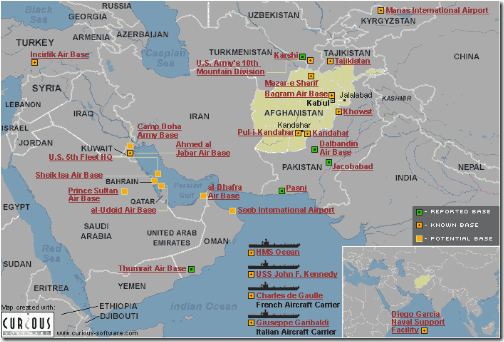

---

A year ago, columnist [David Ignatius](http://www.washingtonpost.com/wp-dyn/content/article/2008/08/01/AR2008080102872.html) dismissed the possibility of an Israeli attack on Iran. But, like a bad penny, it's a story that keeps coming back.

Pundit [M. J. Rosenberg's last posting on Talking Points](http://tpmcafe.talkingpointsmemo.com/2009/09/05/get_ready_big_push_for_liberals_to_support_iran_wa/) warns that the Fall will bring renewed calls for liberals to support a military attack on Iran -- not necessarily a U.S. attack, but one by Israel. Rosenberg points to _hasbara_ efforts by Jewish organizations to soften up public acceptance of an Israeli military strike on Iran. And there are many: [AIPAC statements](http://www.aipac.org/For_Hill_Staff/IssueArchive_19149.asp), the [view from Israel](http://www.jpost.com/servlet/Satellite?apage=1&cid=1251804485261) that contradicts the State Department's assessment of Iran's nuclear readiness, the [American Jewish Committee](http://cgis.jpost.com/Blogs/harris/), the [Zionist Organization of America](http://www.zoa.org/sitedocuments/pressrelease_view.asp?pressreleaseID=1636), the [World Jewish Congress](http://www.worldjewishcongress.org/iran.html), the [Conference of Presidents of Major Jewish Organizations](http://www.conferenceofpresidents.org/meetings.asp?ArtCat=1http://www.conferenceofpresidents.org/meetings.asp?ArtCat=1&ArtID=24ArtID=24), and a [poll commissioned by the Israel Project](http://www.theisraelproject.org/site/apps/nlnet/content2.aspx?c=hsJPK0PIJpHhttp://www.theisraelproject.org/site/apps/nlnet/content2.aspx?c=hsJPK0PIJpH&b=689705&ct=7462631b=689705http://www.theisraelproject.org/site/apps/nlnet/content2.aspx?c=hsJPK0PIJpH&b=689705&ct=7462631ct=7462631) which purports to show a massive increase in public support for a specifically Jewish state and concern over Iran's nuclear program. But not a peep about Israel's own nuclear program.

And those are the _measured_ statements. [Joshua Muravchik](http://www.latimes.com/news/printedition/opinion/la-op-muravchik19nov19,0,2220597.story) and John Bolton of the American Enterprise Institute, openly calls for bombing Iran. As do [Michael Freund](http://www.jpost.com/servlet/Satellite?cid=1195546681706) of Shavei Israel, Connecticut's [Joe Lieberman](http://www.nytimes.com/2007/10/10/opinion/10dowd.html), [Norman Podhoretz](http://www.wsj.com/articles/federation_feature?id=110010139), and many others.

But this is not an altogether new story.

A year ago [Israel conducted war games](http://www.nytimes.com/2008/06/20/washington/20iran.html?_r=1&hp&oref=slogin) U.S. officials said were intended to send Iran a threatening message. The [BBC reported the same story](http://news.bbc.co.uk/2/hi/middle_east/7465170.stm) as "Israelis 'rehearse Iran Attack'."

In February [Reuters reported](http://www.reuters.com/article/latestCrisis/idUSL4624921) that Israel claimed that time was running out and it had only about another year to attack Iran. 

In May [Benjamin Netanyahu and Ehud Barak offered](http://jta.org/news/article/2009/05/26/1005413/netanyahu-outposts-in-exchange-for-iran) to give up settlement outposts in exchange for the U.S. letting Israel "focus its attention on the Iranian nuclear threat". Make your own inferences about what that means.

In July, the [Jerusalem Post reported](http://www.jpost.com/servlet/Satellite?cid=1246443824234) that a deal between European nations and Israel was evolving, which would permit Israel to attack Iran in exchange for unspecified "concessions in peace negotiations with the Palestinians and Arab neighbors."

But back to Rosenberg. His particular insights are within American halls of Congress:
  > Anyway, this fall will be critical. While we're sweating the health care issue, the usual suspects will be ignoring all that and trying hard to set us up for a third war in the Muslim world. And, I hear, that it will be a bipartisan coalition of Democrats and Republicans who will join in opposition to President Obama to sneak this one by us. Why not? Both parties want to please the pro-war crowd in advance of the 2010 elections. Watch your favorite liberal. I expect that if you pay attention, you will hear things that you haven't heard come out of a Democrat's mouth since the run-up to Iraq. [...] If we go to war or give Israel a permission slip, it will be the Democrats who bear prime responsibility. Pay attention.  

Participating in, or permitting, an attack on Iran would have frightful consequences. The [Christian Science Monitor](http://www.csmonitor.com/2008/0620/p07s04-wome.html) ran an article last June entitled 'How Iran would retaliate if it comes to war.' The [Atlantic Monthly](http://jamesfallows.theatlantic.com/archives/2009/03/here_we_go_again_the_feasibili.php) ran one titled 'What if the Israelis bomb Iran' War colleges, foreign policy wonks, and even [Fleet Street](http://www.dailyreckoning.co.uk/oil/oil-outlook/iran-bomb-gulf-oil-price-explode-03765.html) and [Wall Street](http://online.wsj.com/article/SB10001424052970203863204574348533106427974.html) have begun speculating on the results of such an attack. 

Rosenberg has it _partly_ correct: the current administration and a Democrat majority will bear responsibility for either condoning or providing support for an Israeli attack. Who now blames the Viet Nam war on anyone but LBJ and the Democrats?

But judging by the number of Zionist organizations rooting for war with Iran, this constituency should _also_ be held accountable. American Zionist organizations may resent the claim that Jews are being unfairly associated with neoconservative politics and Israel advocacy at odds with American interests. But if this were true, then they would stop wallowing in that swamp and dragging American Jews, whom they claim to represent, into the muck with them. 

Both Democrats and American Jews will be blamed for any war on Iran.

And finally, if anyone has any doubts that the United States would _not_ be pulled into this war, look at a map:

