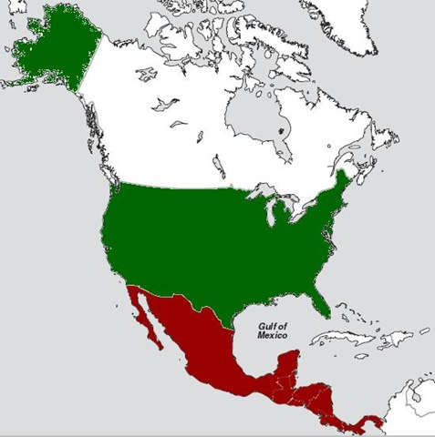

---

You can get a sense of the scope of the Israeli occupation by imagining what it would be like if the United States occupied an area and a population in the same proportions as Israel's occupation of Palestine:

According to [CIA World Factbook](http://www.cia.gov/library/publications/the-world-factbook/) data, Israel's current population is 7,233,701, ours is 307,212,123. Israel's land area is 22,072 sq km, ours is 9,826,674. The West Bank's area is 5,860 sq km. According to the human rights organization [Adalah](http://www.adalah.org/eng/), there are 22,000 political prisoners in Israeli jails. According to the [United Nations](http://www.un.org/apps/news/story.asp?NewsID=30935&Cr=palestin&Cr1), there were 634 military checkpoints in the West Bank in June 2009. According to the [International Institute For Strategic Studies](http://www.iiss.org/whats-new/iiss-in-the-press/press-coverage-2006/july-2006/strength-of-israel-lebanon-and-hezbollah/), Israel has an estimated 168,000 troops, 408,000 reservists, compared with [Department of Defense figures](http://en.wikipedia.org/wiki/United_States_armed_forces) showing an estimated 1,445,000 troops, 850,000 reservists in the US.

### How vast would the occupation be?

*   If the United States were Israel, it would be maintaining an area of 2,608,931 sq km under martial law -- the combined land mass of Mexico, all of Central America (and North Korea, to complete the total) .
*   If the United States were Israel, it would be imposing martial law on 104,528,935 people -- almost the entire population of Mexico.
*   If the United States were Israel, it would have 7,134,887 soldiers on active duty, with most supporting the occupation, and 17,327,582 on active reserves.
*   If the United States were Israel, it would have 934,330 political prisoners in jail.
*   If the United States were Israel, it would control 276,921 checkpoints throughout its occupied territories.

### How can Israel afford this?

Since 1948 Israel has been the beneficiary of, conservatively, over $114 billion in [aid from the United States](http://www.ifamericansknew.org/stats/114bill.html), more in loan guarantees, and the actual costs to U.S. taxpayers have even been greater due to the fact that the United States must pay interest on money we borrow to finance these expenditures. This dollar amount represents only _public_ money to Israel, not funding from North American Zionist philanthropies.

*   If the United States were Israel, the total value in foreign aid received would be $4.84 _trillion_ dollars.
*   This hypothetical, extrapolated figure represents one-half of the [American public debt](http://en.wikipedia.org/wiki/United_States_public_debt), so it is not an exaggeration to say that the United States has been sustaining not only the Israeli economy but the occupation of Palestine; yet [Israel's own deficit](http://israelnewsletter.com/2009/01/13/israeli-budget-defecit-rises/) is only 2% of GDB, so this is aid we cannot afford to give Israel.
