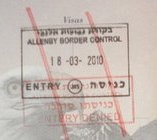

---

_(Welcome to the Soviet Union)_

Today [Israel barred Noam Chomsky](http://www.haaretz.com/news/national/noam-chomsky-denied-entry-into-israel-1.290701) from entering the West Bank. Chomsky was to have given a talk at Bir Zeit University in Ramallah.

Chomsky attempted to cross into Palestine at the Allenby Bridge, directly into the Occupied Territories, and his speech would not have posed a security risk to Israel.

Barring foreign nationals from Palestinian territory is one more method of denying Palestinian sovereignty. It is also a way of punishing critics of Israel, even while it violates international human rights agreements. It is a way of collectively punishing Palestinians for their resistance to the Occupation. And, importantly, it is another nail in the coffin for Israeli democracy. Like the former Soviet Union, Israel is rapidly becoming a nation that can't take any sort of criticism - whether from liberal Jews or American politicians who perform obeisance at AIPAC conventions.

Israel has limited entry to the Occupied Territories to non-governmental organizations, intellectuals with critiques of the Israeli state and, amusingly, this week deported a Spanish clown who was going to perform in Ramallah, on the grounds that the clown was a terrorist. 

In 2008, [Ha'aretz reported](http://www.haaretz.com/print-edition/news/number-of-people-denied-entry-into-israel-up-61-percent-since-2005-1.247841) that the number of people denied entry to Israel had risen by 61%. [Krista Johnson](http://karmalised.com/?p=2687), an employee of an NGO, was denied entry to Israel after attending a Sabeel conference in Boston (suggesting that the Shi Bet is spying on American here in the US). A [Druze family](http://www.haaretz.com/print-edition/news/israel-refuses-re-entry-to-5-druze-who-made-condolence-call-in-syria-1.290301) was denied re-entry into Israel after making a condolence call to family in Syria. [Kate Maynard](http://electronicintifada.net/v2/article4744.shtml), a British human rights lawyer, was denied entry to Israel in 2005. Recently, [Jared Malsin](http://www.smh.com.au/world/american-journalist-denied-entry-to-israel-20100121-mocs.html), an American Jew who had been hired by the Palestinian news service Maan to produce English-language news, was arrested, imprisoned and deported. Israel has regularly [turned away physicians](http://www.haaretz.com/news/delegation-of-israeli-doctors-to-gaza-denied-entry-1.255183) attempting to enter Gaza to provide medical care. One American Jewish critic of Israel, [Norman Finkelstein](http://www.salon.com/news/opinion/glenn_greenwald/2008/05/27/finkelstein), has been banned for ten years from entering Israel.

If you are an Arab-American, travel is even more difficult. Last year an [American law student](http://hlrecord.org/news/harvard-law-student-detained-deported-by-israel-1.1090599) from Harvard was deported because she was conducting research on Bedouin land claims. 

What does the [United States Department of State](https://jru.usconsulate.gov/border-crossings.html) have to say about all this? 
  > "Palestinian-Americans Must Enter Through Allenby.&#160; For some time, the government of Israel has not permitted Americans with Palestinian nationality (or even, in some cases, the claim to it) to enter Israel via Ben Gurion Airport.&#160; Many are sent back to the U.S. upon arrival, though some are permitted in, but told they cannot depart Israel via Ben Gurion without special permission (which is rarely granted)."  

In other words, _we know our own citizens are being racially profiled but we aren't going to do anything about it._

This reminds me of the Cold War decades when one of the things which upset Americans most about the Soviet Union was the tight control of cultural visas. Or that American Jews were routinely arrested or banned from the Soviet Union for attempting to free or organize Soviet Jews.

Of course, for Palestinians themselves, deportation is nothing new. During the Nakba roughly 800,000 Palestinians were expelled and not permitted to re-enter Israel. In 1967 another quarter of a million Palestinians were expelled. [Since 2002 Israel has deported](http://www.btselem.org/English/Deportation/Index.asp) "undesirables" from the West Bank to the Gaza Strip, truly making Gaza a gulag.

While the word continues to look away from these violations of human rights, many Israelis and a growing number of American and European Jews are becoming concerned by the erosion of any last pretense of democracy. Deportations and expulsions may have served the Soviet Union for some time, but eventually the contradictions of that system collapsed it. Creating "Fortress Israel" may play to the most extreme elements in Israeli and American Jewish society, but ultimately it is a prescription for self-destruction. 
