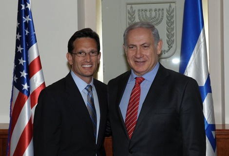

---

Two months ago the United States recognized South Sudan. Last March the US started bombing Libya for regime change. Four months later it recognized that new rebel regime. For decades the United States recognized Taipei, not China, as the legitimate Chinese government. Only in 1972 did the US finally recognize a nation of nearly a billion people.

Despite the ease with which nations can be recognized or ignored, the United States insists that a Palestinian state cannot exist without further negotiations with a [Likud government whose party platform says](http://www.knesset.gov.il/elections/knesset15/elikud_m.htm): "Israel flatly rejects the establishment of a Palestinian Arab state west of the Jordan River. [..] The Palestinians can run their lives freely in the framework of self-rule, but not as an independent and sovereign state."

For decades the United States has mouthed support for a Two State solution. But for 42 years US-mediated talks have produced nothing but delays during which Israel continued its military occupation and built more settlements. In 2009 President Obama went to Cairo and again made promises to resolve the issue. But once again the US has failed to deliver.

On Friday, frustrated by four decades of stonewalling and US bias, Palestinian president Mahmoud Abbas will go to the UN and, in more a poker play than anything, will ask the Security Council to grant Palestine the same type of statehood that it granted Israel 63 years ago. Though this will almost certainly be defeated, Abbas will finally force the US to show its hand. The US has promised Israel it will use its veto to kill a Palestinian state despite the fact that over three quarters of the General Assembly support it.

The reasons for a US veto run counter to its own interests in supporting democracy and peace in the Middle East. Instead, they are motivated by a powerful pro-Israel lobby and by growing "Old Testament" fundamentalism among a Congress which sees Israel as a divine nation.

[Last month a fifth of all American Congressmen](http://walt.foreignpolicy.com/posts/2011/08/11/the_greatest_elected_body_that_money_can_buy) and half of all Freshman Congressmen accepted free junkets to Israel funded by a wing of AIPAC instead of facing their own constituents on economic issues during the recess. At the same time, the Israel Project, a right-wing, Muslim-bashing group, brought 18 American ambassadors to Israel as well.

All this effort was to kill a Palestinian state. The pressures that both Democrats and Republicans feeding at the trough of the Israel Lobby or acting out of religious sentiment exert on foreign policy is intense. Intense and extremely dangerous.

Dangerous because the United States is ignoring the lessons of the Arab Spring - that its pliant regimes in Egypt, Morocco, Algeria, Jordan, Saudi Arabia, Kuwait, Yemen, Oman, Bahrain, and elsewhere are despised; and, by extension, the US is too for supporting them.

Dangerous because former allies like Egypt and Turkey have finally had it with biased US foreign policy and now see the United States as toxic and irrelevant. Even the Saudis have threatened to reevaluate their relationship with the United States. And Turkey is starting to challenge the US as a regional power broker.

Dangerous because the United States is becoming isolated internationally by confusing Israeli interests for our own. Two weeks ago, in a speech at the Jewish People Policy Institute, [Ambassador Daniel Shapiro said it](http://jppi.org.il/news/93/58/Remarks-to-the-JPPI-by-US-Ambassador-Daniel-B-Shapiro/) quite bluntly: "The test of every policy the Administration develops in the Middle East is whether it is consistent with the goal of ensuring Israel's future as a secure, Jewish, democratic state. That is a commitment that runs as a common thread through our entire government." 

Dangerous because an isolated US and Israel make war more likely.

This subservience to a foreign nation's interests troubles even strong Israel supporters.

New York Times [columnist Tom Friedman worried in a recent editorial](http://www.nytimes.com/2011/09/18/opinion/sunday/friedman-israel-adrift-at-sea-alone.html) that Israel's policies have "left the U.S. government fed up with Israel's leadership but a hostage to its ineptitude, because the powerful pro-Israel lobby in an election season can force the administration to defend Israel at the U.N., even when it knows Israel is pursuing policies not in its own interest or America's." Friedman thinks the US is painting itself into a corner with its veto: "the U.S. does not have to cast a U.N. veto on a Palestinian state, which could be disastrous in an Arab world increasingly moving toward more popular self-rule."

Once the Israel Lobby digests its meal of the remains of the Palestinian state, what's next on the menu? Already the [pro-Israel hawks are calling for war on Iran](http://www.lobelog.com/fox-news-anchor-surprised-that-iran-hawks-offices-are-in-israel/). Most of the Republican hopefuls are nodding in agreement with Israeli Deputy Foreign Minister Danny Ayalon when he says: "All options are on the table."

Whose table is that?
