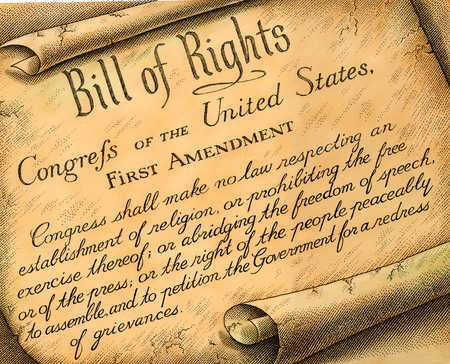

---

There's no pretty way to say it — Zionism is incompatible with American values. American Zionists do not — _can not_ — really claim to respect Constitutional principles of separation of church and state, basic equality, or a democracy for all citizens. To be fair, fundamentalists of all stripes lack respect for these values, but American Jews are not typically fundamentalists.

Yet it is astounding to speak with normally liberal, tolerant fellow Jews — who fear creeping Christian fundamentalism or express contempt for _shariah_ in places like Afghanistan — but who see nothing wrong with creeping Jewish _shariah_ (_pardon me, halakha_) in Israel. Or who find nothing wrong with expressly making Palestinians second class citizens. Their argument is simple — _there are many Arab countries but only one Israel; the Palestinians should simply go away so that a Jewish state can exist. What's so wrong with that?_ 

Of course such an argument makes as much sense as forcing Native Americans to go back to &#8212; _where? Asia?_ &#8212; because America is now mainly a Caucasian nation. Yet the argument for Zionism voiced by many American Jews is essentially the same and it could quite easily be turned against us. For example, some future Evangelical Avigdor Lieberman (spawning in a Tea Party test tube somewhere as I write this) could simply declare the US a Christian nation. Legal, social, and professional rights would be restricted for non-Christians in this nightmare world. Jewish heretics who taught evolution would end up in the slammer. Jewish civil libertarians would be given the same treatment they were given in the early 1900's when everyone suspected them of being anarchists; or given the same treatment that they got in the 1950's when everyone suspected them of being communists. Most Jews are liberals precisely out of such fears &#8212; at least on one side of the brain.

But then there's Israel. Many Jews regard Israel as an "insurance policy" against precisely the kind of Christian dystopia I just described. But this is where the two hemispheres of our brains do not seem to be connected. On the one hand, we have our fears. On the other, we are completely prepared to inflict the same violence and ill-treatment on Palestinians. In fact, it's worse than that. We wouldn't do it _ourselves_ – after all, here in America we have friends everywhere in business, at university, in the community, who are Muslim. But Israel, as the _ultimate insurance policy_, must be allowed to do anything it likes as long as it exists to protect us from our most secret fears. 

But there are many other aspects of Israel for American Jews. Israel is the land of the patriarchs, the landscape of the prophets and of countless Torah stories. Jewish fundamentalists believe it was literally given by God (although they would like to have David's Kingdom, which includes Jordan, Iraq, Lebanon, and more real estate). For some Israel is a Jewish Disneyland where American Jews can go to live out a fantasy of returning to our roots — even though, as Helen Thomas pointed out, our roots might _actually_ be in Germany, Poland, Russia, or Lithuania. As a secular Jew, it seems to me that the allure of _making aliyah_ (emigrating to Israel) fulfils a mainly psychological function. American Jews from Brookline to Orange County are not in any kind of real danger, so _let's be honest_ — they are not moving to Israel to ensure Jewish survival. And let's be a little _more_ honest — when you move from country A to country B, you _do_ love country B more. 

While Jews have always revered the land of our ancestors and desired some kind of return to Israel &#8212; at least by the pious among us &#8212; Judaism managed to survive thousands of years without the Revisionist Zionism of today. During all these centuries, Jewishness was something preserved in cultural diversity, observance of the law, study of the Torah or &#8212; for the more secular &#8212; in Judaism's ethics. Collectively the "Jewish people" &#8212; _Klal Yisrael_ &#8212; meant many different things. But when the Jewish state came into existence, Zionism expropriated thousands of years of tradition and understanding and replaced "the Jewish people" with a state to which all Jews were able (if not obligated) to immigrate. And this state has not done a particularly good job of preserving the Jewish cultural diversity of the past; as in any society, there are winners and losers. In Israel the _Ashkenazim_ now determine what Germans like to call the _Leitkultur_. Yet most American Jews now speak of their _great love_ for this particular state, its _centrality_ to their Jewish identity, and even the _siddurim_ (prayer books) make references to the _modern_ state &#8212; not just the biblical one &#8212; and offer prayers for it. In religious institutions, the preoccupation with the state of Israel has advanced nearly to the point of idolatry. 

All these seem to be symptoms of some serious cognitive disorder. We just can't help ourselves. Real estate has taken priority over values. We are no different from the _Wahhabists_.  Jerusalem and Hebron are our Mecca and Medina. Our attachment to Judaism is now defined only by this new nation-state. Without Israel, our identities would be _shattered_, our faith _incomplete_, our hope for redemption _lost_. And don't forget the Holocaust! We are a _traumatized_ people! It is argued to the point of annoyance that Israel is necessary as a refuge to preserve Jewish existence. But even if it no longer serves an _existential_ purpose, then it is a _psychological_ homeland for people who can never return to Europe. Of course I am glad that so much positive mental health has been achieved, but I also care about the Palestinians. 

I am sitting here on the eve of national elections a free man, permitted to vote, to write letters to the editor, to demonstrate, to live in a neighborhood with people of other ethnicities and religions, and I live under the same laws that apply to all citizens. My home cannot be summarily bulldozed with twenty-four hour notice. My neighborhood cannot be declared a military zone one day and then given to a Christian developer the next. Except for exceptional circumstances If I run afoul of the law I will be tried under transparent civilian laws, not by a military tribunal.

I am a free man and a free Jew _not_ because of Israel but because of a bunch of privileged white male slave holders whose flawed but thoughtful and _secular_ vision of democracy was nevertheless sound enough to endure and to improve upon for a couple of centuries. Meanwhile, the "Jewish state" we love so much exhibits an advanced case of the disease starting to afflict us here. In Israel non-Jews barely merit being treated as human, democracy is in shambles, and I am left to wonder whose perverted concept of Judaism managed to make Israel a nation which (for many Jews) has become a _proxy_ for authentic Jewish values or practices. 

You can't be a Zionist _and_ claim to revere American-style democracy too.