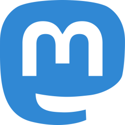

---
 

I have never felt good about giving social networks all my personal information to sell as they see fit. However, with a mass exodus of Twitter users to Mastodon underway, I thought I would check it out. And  <a rel="me" href="https://mastodon.world/@precaf">Mastodon</a> has a completely different vibe.

I'm now posting a few things, and you can reach me at <a rel="me" target="_blank" href="https://mastodon.world/@precaf">mastodon.world/@precaf</a>.

Mastodon is a "federated" (distributed) network where each "instance" (node or server) is managed by ordinary people like you and me, not some sociopathic billionaire. Although the network is distributed, you can follow anyone on any other instance. Selecting an instance to join is probably the most difficult part of joining Mastodon ("choices, choices..."), so here is an invitation to join mine:

[https://mastodon.world/invite/zesf6paA](https://mastodon.world/invite/zesf6paA)

