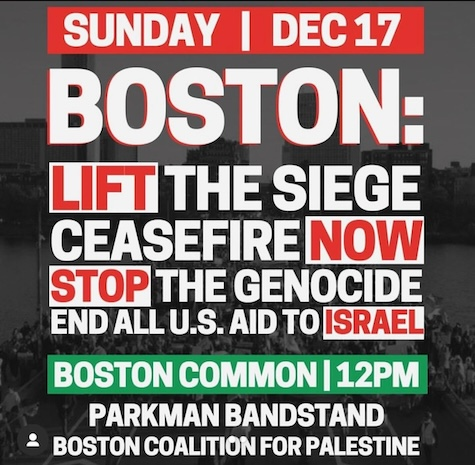

# BUS to the Sunday, December 17th NOON rally at Boston Common

The New Bedford coalition working for a ceasefire in Gaza is providing a **BUS to the Sunday, December 17th NOON rally at Boston Common**.

The bus will leave the Mount Pleasant, **New Bedford Park and Ride at 10:15 SHARP** on Sunday the 17th. 

Plan on being at the Park and Ride at least 15 minutes before the bus leaves.

The bus will reeturn to New Bedford by approximately 5PM.

Please **TEXT** Richard Drolet at [508-375-5331](sms:508-375-5331) **NO LATER THAN FRIDAY @ NOON** if you are interested in a ride. 

Riders will receive a sandwich, chips, and cookies. 

Suggested donation of $20, but we have some sponsors and money shouldn't stop you from going.

