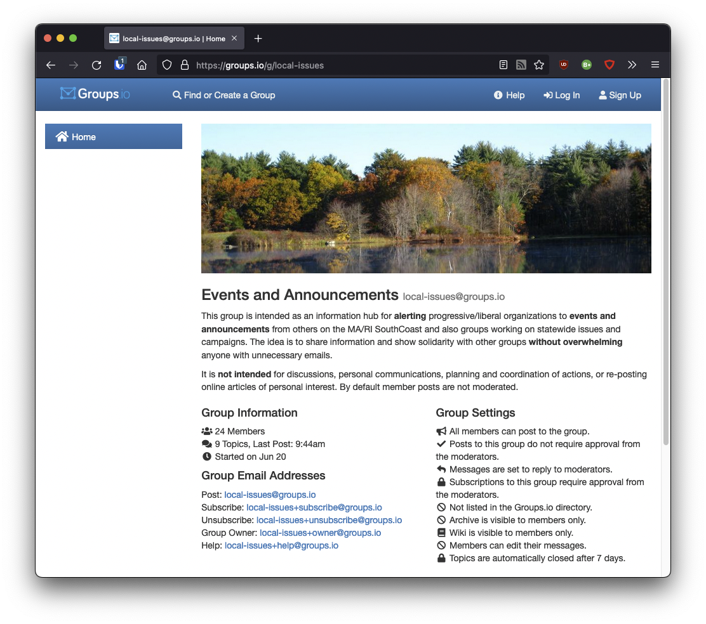
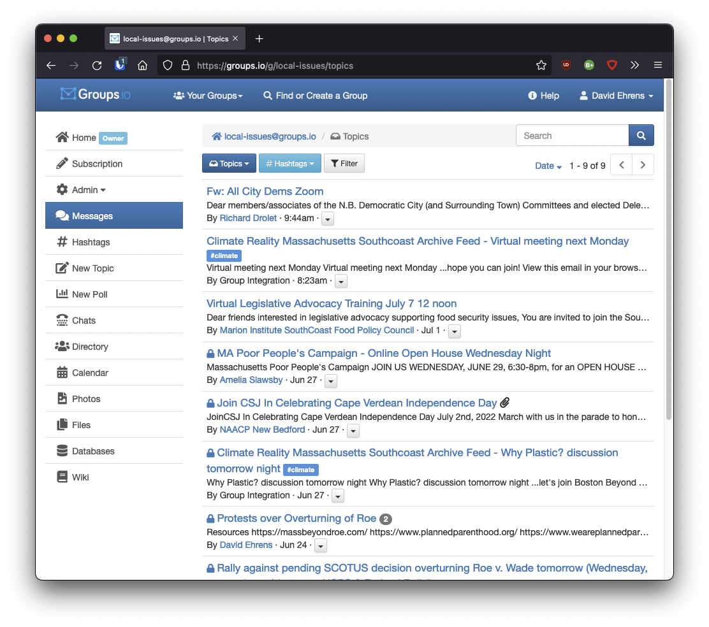
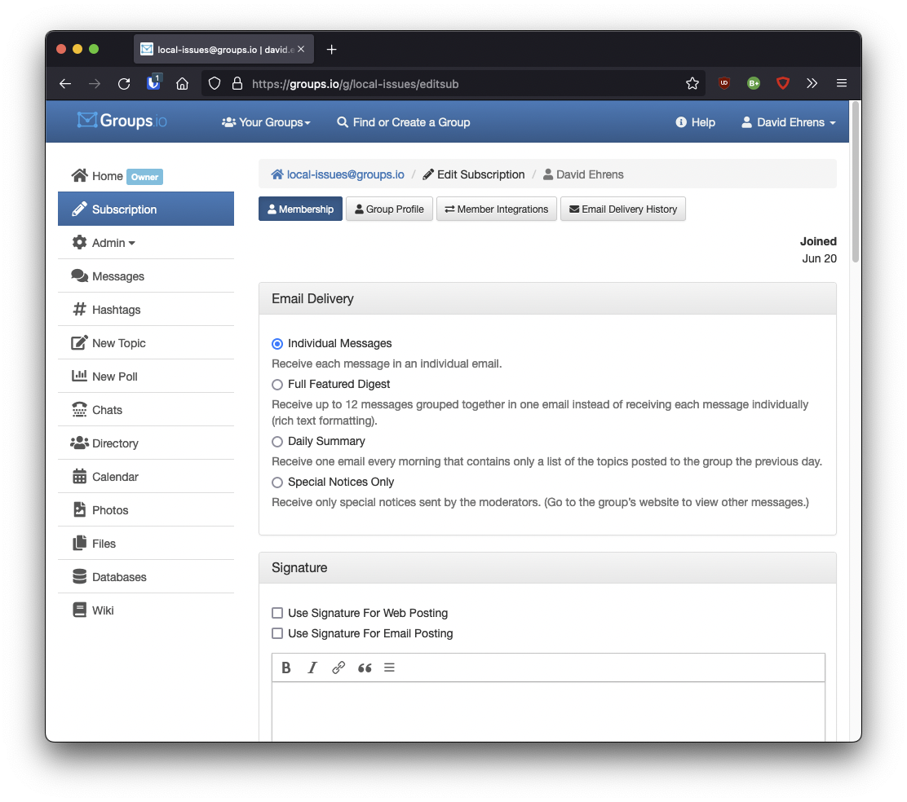
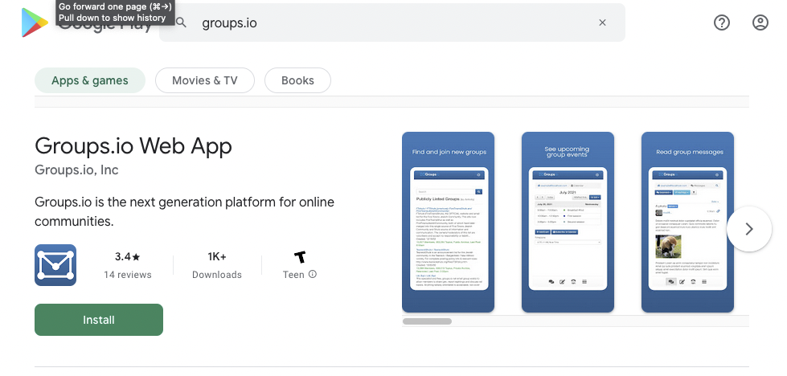
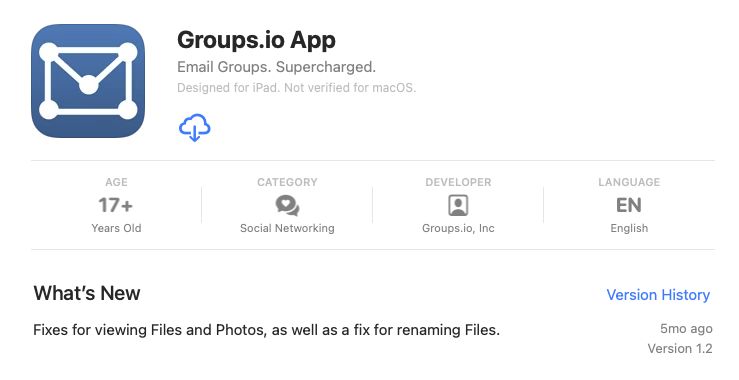

#### How to better use local-issues@groups.io

This Listserv is mainly for announcement and events so that we can support one another's initiatives. So far it has been fairly low-volume. Feel free to share your events and organizational announcements by simply sending an email to

local-issues@groups.io

Although this service is email-based, like any listserv you don't have to receive every email if you don't want to. There is a web interface that permits you to check messages:

https://groups.io/g/local-issues

After you enter this in your browsre, you will then see something like this:

It is a private group and you will need to log in. Since you are already a member, click on "Log In" at the top right and you will see something like the following:

Type in your email address and then click the "Forgot your password" link. You will receive a temporary link by email with which you can set up a password for directly logging-in.

Once that is set up you can log in and read *all the messages that have ever been posted* (which also means you don't necessarily have to hold on to emails):

In addition you can click on "Subscription" and modify how you receive messages. If you want to check messages exclusively via browser, select "Special Notices Only." If you'd like to have all of the day's messages bundled together into one, select "Full Featured Digest." Otherwise, leave your subscription to receive "Individual Messages."

There is also an Android app you can use to read messages:

And an iOS app as well:

